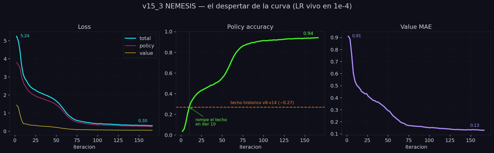
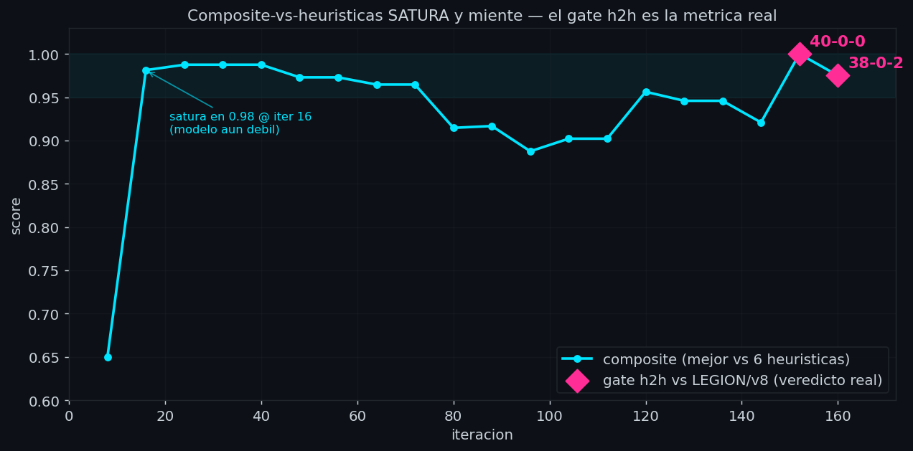
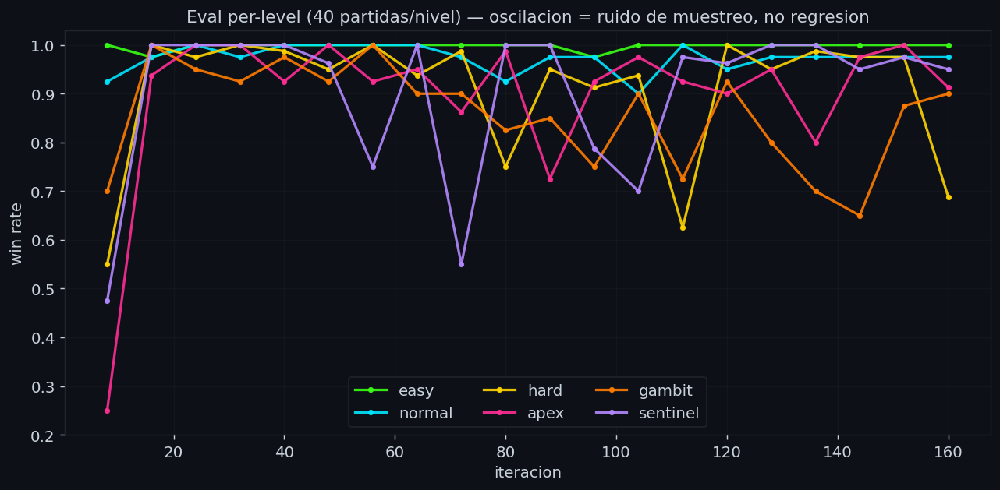

# Postmortem 12 — `nemesis` (v15_3, iter 166/600, en curso)

## TL;DR

La alpha. El salto que catorce generaciones no habían podido dar.

Durante toda la familia v11–v14 el modelo golpeó el mismo techo:
`policy_accuracy ~0.27`. v15 juntó **31 fixes estructurales** sobre
v13.1 (modelo más grande, 4 canales nuevos, MCTS canónico, self-play
puro con league). Pero el paquete all-in venía con un fix número 32
escondido que **tapaba a los otros 31**: el commit que shipeó las
mejoras (`8e3bf92`) también introdujo `lr_warmup_steps=1000`, y con el
loop de entrenamiento que llama `fit()` una vez por iteración, el
scheduler de warmup se reiniciaba en cada vuelta y **clavaba el LR en
~3e-6 para siempre**. El modelo no aprendía — no porque las 31 mejoras
fueran malas, sino porque el LR estaba muerto.

El fix crítico (`8cc9069`) fue una línea: `lr_warmup_steps=0`. Con el
LR vivo en 1e-4, la curva despertó de golpe:

| métrica | v14 (techo) | nemesis @166 |
|---|---|---|
| policy_accuracy | ~0.27 | **0.940** |
| value_mae | ~0.61 | **0.129** |
| loss total | — | **0.299** |

nemesis barre las 6 heurísticas y, por primera vez en la historia del
repo, **a Diego no le gana ninguna en arena a 200 sims**. El gate
objetivo head-to-head vs LEGIÓN/v8 (codename `liga`, la generación
anterior) cayó **40-0-0** en iter 152 y **38-0-2** en iter 160. No es
composite-vs-heurísticas saturado (PM05): es un veredicto canónico
directo contra el campeón previo. Over-human confirmado por dos vías
independientes: subjetiva (el humano ya no le gana) y objetiva (aplasta
a la generación anterior). El run sigue: 166 de 600 iteraciones.

## Contexto — el techo de las 14 generaciones

PM05 y PM10–11 documentaron el plateau. Desde `liga` (v8) hasta v14,
ninguna generación rompió `policy_accuracy ~0.27`. Las hipótesis
fueron rotando: opponent exploitation (PM05), curriculum desbalanceado
(PM10–11), arquitectura, cantidad de data humana. v13.1 cerró con
`LR=1e-4 + pretrain` intentando atacar inestabilidad del optimizer, y
aun así no despegó.

v15 fue deliberadamente un **paquete all-in**: en vez de cambiar una
palanca por run (la disciplina experimental de v13), se juntaron 31
cambios estructurales de una. La apuesta: si el techo era multi-causal,
mover una variable a la vez nunca lo iba a romper. El costo aceptado:
si funcionaba, no sabríamos *cuál* cambio lo logró (sin ablaciones).

### Qué shipeó v15 (`8e3bf92`)

- **Arquitectura**: Pre-LN, `pos_embed_2d`, `patch_embed_conv` 3×3
  (sesgo inductivo espacial), `value_head_depth=1`, count head off,
  dropout 0. d_model 192→**384**, 8→**12** capas, nhead=6, dim_ff=768.
- **Input 11→15 canales** (los 4 nuevos, abajo en detalle).
- **MCTS canónico**: FPU, virtual loss, dirichlet 0.30, prior mix 0.20,
  forced playouts + policy target pruning, playout cap randomization.
- **Self-play puro + league**: move cap 120, aperturas aleatorias,
  `temp_threshold` 28→8, episodes/iter 6→18, buffer 200K.
- **Training**: Q-mix value target (λ=0.25), EMA 0.999, AdamW con
  weight-decay exclusion, betas (0.9, 0.95).

Y, enterrado en la sección de training de ese mismo commit:
`LR 2e-4 + warmup 1000`. El caballo de Troya.

## El bug central — warmup × loop fit-por-iteración

Este es el corazón del postmortem y el tipo de bug que se repite si no
queda escrito.

El warmup de learning rate no es malo en general — sirve para que el
optimizer no dé pasos gigantes al principio. El problema es de
**interacción** con nuestra arquitectura de entrenamiento:

1. El loop de training llama a `trainer.fit()` **una vez por
   iteración** de AlphaZero (self-play → fit → eval → repeat).
2. PyTorch Lightning **reinicia el LR scheduler en cada `fit()`**,
   desde `global_step=0`.
3. Con `lr_warmup_steps=1000`, el LR arranca cada `fit()` en ~0 y rampa
   hacia el target. Pero cada `fit()` corre pocos steps (los de una
   iteración) y termina **antes de salir de la rampa**.
4. Resultado: el LR **nunca** llega al target. Queda clavado en el piso
   de la rampa, ~3e-6, iteración tras iteración, para siempre.

Lo contraintuitivo: esto pasa **aún dentro de una sola ventana continua
de Kaggle**. No es un problema de que Kaggle corte el run cada 9–12h
(aunque entender esa mecánica importa — ver abajo). Es que el loop
*reinicia* el scheduler en cada iteración por diseño, así que el
warmup nunca avanza ni en un run perfectamente continuo.

La mecánica de Kaggle igual es fundamental tenerla clara: los runs **no
son continuos**, son ventanas de ~9–12h resumibles (`hf_reset_iteration
=false` reanuda desde el último checkpoint en HF). El instinto de que
"el warmup no tiene sentido acá porque no es un run continuo" apunta a
la verdad — pero la causa raíz es un nivel más abajo: el `fit()`
por-iteración, que rompe la suposición de continuidad del scheduler
incluso sin que Kaggle corte nada.

**El fix** (`8cc9069`) fue una línea: `lr_warmup_steps=0`. El LR quedó
firme en 1e-4 desde el step 1. La curva despertó en la siguiente
corrida limpia (`policy_spatial_v15_3`).

Queda como invariante del repo (ver memoria `lr-warmup-breaks-per-fit
-loop`): **mientras el loop llame `fit()` por iteración, cualquier
scheduler dependiente de step que no quepa en una sola iteración queda
roto.** Si algún día se quiere warmup de verdad, hay que mover el
scheduler fuera del `fit()` per-iteración (estado global persistente).

## Trayectoria — la curva que despertó

`policy_spatial_v15_3`, con el LR vivo. Curva de training (monotónica,
sin plateau):

| iter | loss total | loss policy | loss value | pol_acc | value_mae |
|---|---|---|---|---|---|
|   2 | 5.244 | 3.808 | 1.437 | 0.035 | 0.910 |
|  10 | 3.134 | 2.716 | 0.418 | 0.266 | 0.536 |
|  20 | 2.403 | 2.073 | 0.330 | 0.402 | 0.443 |
|  40 | 1.941 | 1.685 | 0.256 | 0.490 | 0.353 |
|  60 | 1.137 | 0.995 | 0.142 | 0.692 | 0.226 |
|  80 | 0.537 | 0.454 | 0.083 | 0.878 | 0.165 |
| 100 | 0.406 | 0.338 | 0.068 | 0.913 | 0.150 |
| 120 | 0.371 | 0.311 | 0.061 | 0.921 | 0.142 |
| 140 | 0.331 | 0.278 | 0.054 | 0.933 | 0.133 |
| 160 | 0.312 | 0.260 | 0.052 | 0.938 | 0.131 |
| 166 | **0.299** | **0.249** | **0.050** | **0.940** | **0.129** |

Dos cosas para subrayar:

1. **`pol_acc` rompió el techo histórico ~0.27 en iter 10** y siguió
   de largo hasta 0.94. Las 14 generaciones previas se quedaron donde
   nemesis pasó en sus primeras 10 iteraciones. El techo nunca fue
   arquitectónico ni de data: era el LR muerto.
2. **No hay plateau a iter 166**. loss, pol_acc y value_mae siguen
   siendo los mejores del run en el último punto medido. El run no
   terminó de subir.

## Eval — por qué el composite no es la métrica

El `composite` (best_eval_score, promedio vs 6 heurísticas) **satura
temprano** y por eso engaña, exactamente como advirtió PM05:

| iter | composite | easy | normal | hard | apex | gambit | sentinel |
|---|---|---|---|---|---|---|---|
|   8 | 0.650 | 1.00 | 0.925 | 0.55 | 0.25 | 0.70 | 0.475 |
|  16 | 0.981 | 0.975 | 0.975 | 1.00 | 0.938 | 1.00 | 1.00 |
|  40 | 0.988 | 1.00 | 1.00 | 0.988 | 0.925 | 0.975 | 1.00 |
|  96 | 0.888 | 0.975 | 0.975 | 0.913 | 0.925 | 0.75 | 0.788 |
| 152 | **1.000** | 1.00 | 0.975 | 0.975 | 1.00 | 0.875 | 0.975 |
| 160 | 0.975 | 1.00 | 0.975 | 0.688 | 0.913 | 0.90 | 0.95 |

El composite ya estaba en **0.98 en iter 16** — cuando el modelo era
muchísimo más débil que ahora. Vencer a las heurísticas se satura
rápido; a partir de ahí el composite oscila por ruido de muestreo (40
partidas por nivel, ±0.10 de IC95%) y no mide progreso real. La caída
de `hard` a 0.688 en iter 160 es ruido puntual de muestreo, no
regresión: la curva de training mejoró en ese mismo tramo.

Cada nivel se evalúa con 40 partidas (IC95% ±0.10), así que los picos
y valles de cada serie son ruido, no señal. La lectura correcta no es
"¿bajó `hard`?" sino "¿la banda completa sigue arriba?" — y todos los
niveles viven sobre 0.65 desde iter 16, casi todos sobre 0.90.

**La métrica que sí importa es el gate head-to-head vs la generación
anterior**, que arranca en iter 150:

| iter | h2h vs LEGIÓN/v8 (`liga`) | W-L-D |
|---|---|---|
| 152 | **1.000** | 40-0-0 |
| 160 | **0.975** | 38-0-2 |

Esto es lo que PM05 pedía: un veredicto objetivo directo contra el
campeón previo, no un promedio vs heurísticas que se satura. nemesis
no le ganó a `liga` por poco — la barrió, 40 de 40, y en el segundo
gate 38-0 con 2 tablas. Primera vez en el repo que una generación
aplasta a la anterior de forma inequívoca.

## Los 4 canales nuevos — la intuición de la infección

Input pasó de 11 a 15 canales (`board.py:get_observation`). Los 4
nuevos:

| canal | qué es |
|---|---|
| 11 | **own captures potential** — máx. conversiones si juego acá, /8 |
| 12 | **opp captures potential** — lo mismo desde el rival |
| 13 | last move dst — dónde cayó la última ficha |
| 14 | prev move dst — dónde cayó la penúltima |

Los canales 11/12 son el "cuántas fichas infecto si muevo acá". Es un
sesgo inductivo fuerte y específico de Ataxx: **el juego entero es
conversiones** — flipear las fichas enemigas adyacentes al destino.
Entregarle al transformer un plano precalculado de "este destino da
vuelta N fichas" es un atajo enorme frente a obligarlo a deducir la
geometría de captura desde los planos de piezas crudas. Los canales
13/14 le dan memoria temporal corta (anti-repetición, lectura de
tempo).

**Atribución honesta**: como v15 fue all-in sin ablaciones, no sabemos
la contribución marginal de cada cambio. Pero los roles no son iguales:

> El fix del LR es lo que hizo que el modelo **se moviera**; los canales
> tácticos y el modelo más grande son lo que lo hicieron **fuerte**.

Un modelo con los 4 canales y el LR muerto seguiría muerto (eso es,
literalmente, lo que pasó antes de `8cc9069`). El canal de infección
casi seguro subió el *techo* y la *eficiencia de muestra* — pero no fue
el desbloqueo. Ranking de impacto en el salto: **LR ≫ canales ≈
capacidad**.

## La validación humana

Diego cargó nemesis en arena a 200 sims y, tras ganarle a todas las
generaciones previas, reportó la línea que define el apodo:

> "no ya no le gano jaja"

> "ya es inganable jaja"

La partida más apretada que logró fue 24-25 — finales posicionales
cerrados donde el modelo no comete el error que el humano necesita. Es
la primera generación de la familia que cruza de "se siente amenazante"
(asedio, PM09) a **over-human de verdad**. La dimensión subjetiva que
PM10 pedía formalizar acá coincide con la objetiva: las dos vías dan
el mismo veredicto.

## Lecciones aprendidas

1. **Un scheduler step-dependiente y el loop `fit()`-por-iteración son
   incompatibles.** El warmup clavó el LR en ~3e-6 e hizo invisibles 31
   fixes correctos. Invariante del repo: cualquier scheduler que no
   quepa en una iteración queda roto mientras `fit()` se llame por
   iteración. Si se quiere warmup, mover el scheduler a estado global.

2. **Un paquete all-in puede esconder su propio sabotaje.** Juntar 31
   cambios maximiza la chance de romper el techo multi-causal, pero un
   solo bug entre ellos (el warmup) tapó a los otros 30. La lección no
   es "no hagas all-in" — fue la decisión correcta dado el plateau —
   sino: **al shipear un paquete grande, un smoke que verifique que el
   LR efectivo llega al target hubiera cazado el bug en minutos.**
   Agregar a la checklist de pre-run: loggear `optimizer.param_groups
   [0]['lr']` real en el step 1 de la iteración 2+, no el configurado.

3. **El techo de 14 generaciones nunca fue arquitectónico.** Era el LR.
   `pol_acc` pasó el techo histórico en 10 iteraciones una vez vivo el
   LR. Toda la teoría de "falta data humana / falta capacidad / falta
   curriculum" era explicar un síntoma. Cuando un número se queda
   clavado generación tras generación, sospechar de un parámetro
   muerto antes que de la arquitectura.

4. **El composite-vs-heurísticas se satura y miente** (confirma PM05).
   Llegó a 0.98 en iter 16 con un modelo débil. El gate h2h vs la
   generación anterior es la métrica de progreso real. Para v16+, el
   h2h vs el champion previo debería arrancar antes (iter ~80) y ser
   el criterio de promoción, no el composite.

5. **Entender la mecánica de Kaggle es parte del trabajo de ML.** Runs
   no-continuos, ventanas resumibles de ~9–12h, `hf_reset_iteration=
   false` para reanudar. Las suposiciones de continuidad (schedulers,
   contadores de step globales) tienen que sobrevivir a cortes y
   resumes — y, como mostró el warmup, incluso a la discontinuidad
   interna del loop por-iteración.

## Apodo

**nemesis** — la que no le ganas. Tras 14 generaciones golpeando el
mismo techo, v15 fue el salto: el modelo que Diego ya no puede vencer y
que aplasta a la generación anterior 40-0. No es un campeón marginal
que gana por poco; es una némesis. Tu Skynet, a escala 7×7.

## Checkpoint persistido

`checkpoints/registered/nemesis.pt` — refrescado al iter 166 (último
medido). 58.3MB, arch transformer_spatial_v15 (d_model=384, 12 capas,
15 canales de input, policy head spatial src/dst). 14.562.818
parámetros. Cargable via `resolve('nemesis')` o `--ckpt nemesis`. El
registry mantiene `iter` sincronizado con el archivo; el campo se
refresca cada ventana de Kaggle a medida que el run sube.

## Estado y próximo paso

El run **no terminó**. nemesis está en iter 166 de 600 — quedan ~36
ventanas de Kaggle. El objetivo (over-human) ya se cumplió y está
probado por dos vías, pero el modelo sigue mejorando en cada métrica de
training sin señal de plateau. Cada ventana: refrescar `nemesis.pt`,
actualizar el registry, persistir contexto.

Cuando el run cierre (iter 600 o timeout final), evaluar si vale un
v16. Las palancas abiertas, dado que el techo ya cayó:

1. **Ablaciones retroactivas** — ahora que sabemos que funciona, correr
   variantes (sin canales 11/12, modelo más chico) para *medir* qué
   aportó cada cosa. Cierra la deuda de atribución del all-in.
2. **MCTS sims en eval/arena** — nemesis a 200 sims ya es inganable;
   subir sims solo lo hace más fuerte. No es prioridad.
3. **Gate h2h más temprano** como criterio de promoción canónico,
   reemplazando el composite saturado.
